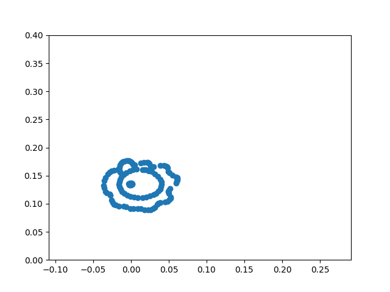

# Graduation project to opt for bachelor's degree in Computer Engineering. Technological Institute of Costa Rica. 
## Steven Andrey Pacheco Portuguez, Universidade Da Coruña Sept-2019 to Dic-2019.
In the present work, we implement a neural network architecture with the ability to transform an image to several strokes in a sequential way it allows us to simulate in a better form the drawing way of the human being, for this we used the QuickDraw! data set, through the use of Sketch-pix2seq architecture. It allows getting a set of strokes to follow given an input image. Consequently, we apply inverse kinematic to reach drawing replication.

Development within the framework of the Professional Practice course - IC8845 of Bachelor's degree Computer Engineering. This research work was carried out with the Integrated Group of Engineering, Ferrol Campus of Universidade da Coruña, Spain

Here we show you an execution example in V-REP simulator, where Poppy robot catch by his camera an image for be processed to strokes

### Requierments
1. numpy
```
pip install numpy
```
2. matplotlib
```
pip install matplotlib
```
3. cv2
```
pip install opencv-python 
```
4. ikpy
```
pip install ikpy
```
5. [V-REP](./V-REP_PRO_EDU_V3_6_2_Ubuntu16_04)

6. For the installation of pypot, you should follow the next guide [guide](./Poppy/README.md)

### Data and Train
For the preparation of the data the repository of [Sketch-pix2seq](https://github.com/MarkMoHR/sketch-pix2seq). Here you can find all necessary steps for pre-processing the dataset and his mode to train.

### Pre-trained model
You can find a pre-trained model in Supercomputing Technological Center of Galicia in the folder [Pretrained Model](./InverseKinematic/code/Pretrained_model). There are two folders corresponding to a model for a single class of objects, in this case, the cat class, and another model with three classes, in this case, lion, bicycles, and bear.

You can use these models only copying the outputs folder of the model that you want to use in [pix2seq](./InverseKinematic/code/pix2seq)

### Configuration
To configure the hyperparameters you only have to modify the file [InverseKinematic.py](./InverseKinematic/code/InverseKinematic.py) in the function *getParams()*

## Execution
For run you have to:
1. Open V-REP simulator
2. Go to the folder [InverseKinematic.py](./InverseKinematic/code) and type the command
```
python InverseKinematic.py
 ```
 ## Demo
 The experiments that we do can you find into the [Results](./Results) folder They are organized by class, these experiments have respective video of the humanoid Poppy. In the image folder you can find four figures, one of them is the plot of all points that Poppy has to reach and the others are the axes moves of the effector of robot.

 For each class you have an example video with all moves that Poppy do for drawing, this means each of the corrections did at the moment of reach a point and another video with only the right points that are taking as acceptable. 

 In the follow image, you can observe all points that the humanoid have to reach for complete a draw, it means all strokes that have to do for execute a sketch of the lion's class.

 

The experiment results you can watch it in:
[](https://youtu.be/_Hf7IB0OtLY)

It is important highlight the use of the inverse kinematic of pypot library doing use of ikpy, for reach the points in a plane. Furthermore you can observe the tracking of the axes during the whole plotting process.


## Contact
[Steven Pacheco-Portuguez](stpacheco@ic-itcr.ac.cr)
[Martin Naya-Varela](martin.naya@udc.es)

## Credits
- The Sketch-pix2seq code was taken of the repository [Sketch-pix2seq](https://github.com/MarkMoHR/sketch-pix2seq)
- The Galician Public Foundation Technological Center of Supercomputing of Galicia (CESGA) for the computational resources provided for training