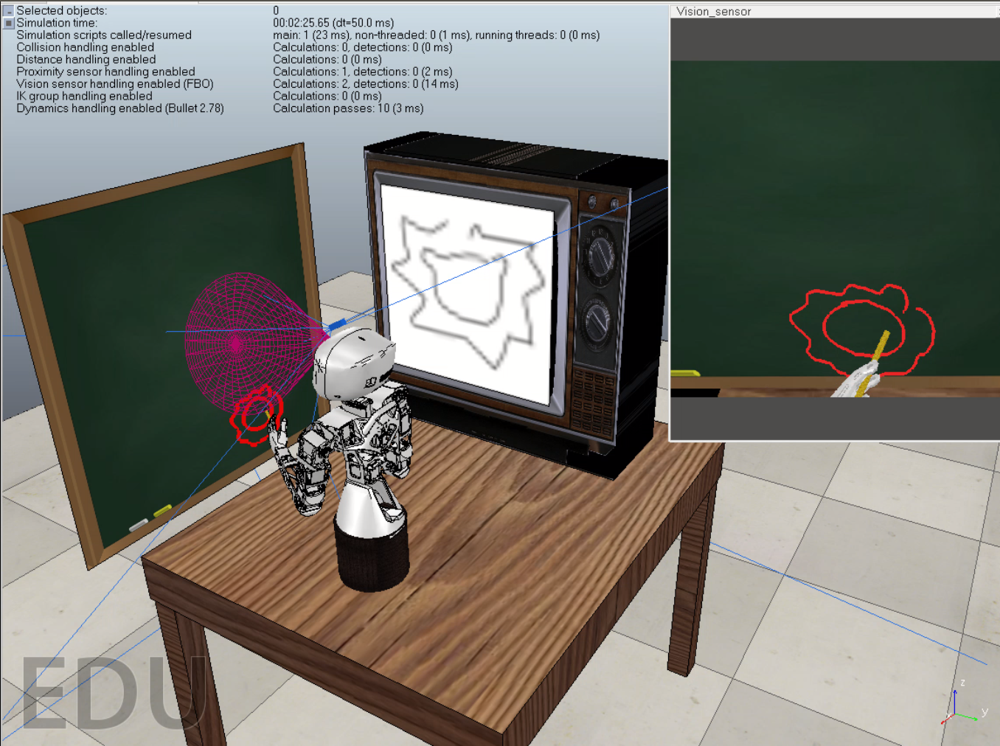
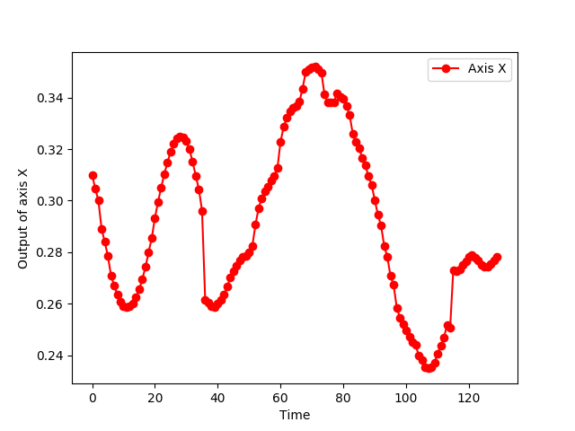
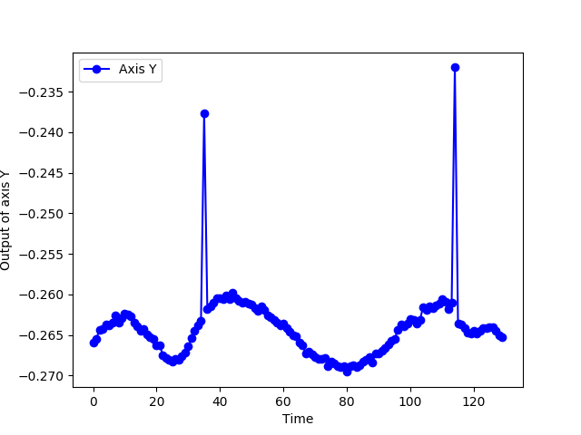
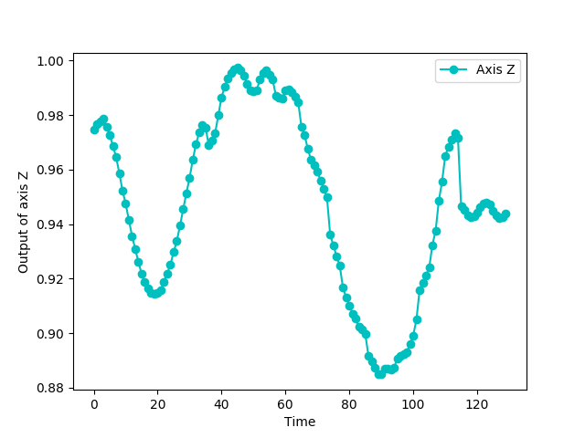

# Proyecto de Graduación para optar por el grado de Bachiller en Ingeniería en Computación. Instituto Tecnológico de Costa Rica
## Steven Andrey Pacheco Portuguez, Universidade Da Coruña Sept-2019 a Dic-2019
En el presente trabajo se implementa una arquitectura de redes neuronales que sea capaz de transformar una imagen en una serie de trazos de manera secuencial que permita simular en mayor medida el proceso de dibujo basado en bocetos de un ser humano, para esto se ha utilizado el conjunto de datos de **QuickDraw!**, que mediante el uso de la arquitectura **Sketch-pix2seq** permite obtener un conjunto de trazos a seguir dada una imagen como entrada. Posterior a eso, a la serie de datos resultantes del modelo se le aplica cinemática inversa para que el robot Poppy sea capaz de ejecutar una replicación del dibujo. 

Desarrollado dentro del marco del curso de Práctica Profesional-IC8842 del grado de bachiller en Ingeniería en Computación. Este trabajo de investigación fue realizado en conjunto con el Grupo Integrado de Ingeniería ubicado en el Campus de Ferrol de la Universidade da Coruña, España

Se muestra un ejemplo de ejecución en el simulador V-REP, donde el robot Poppy captura por medio de su cámara una imagen para ser trazada.

### Requerimientos
1. numpy
```
pip install numpy
```
2. matplotlib
```
pip install matplotlib
```
3. cv2
```
pip install opencv-python 
```
4. ikpy
```
pip install ikpy
```
5. [V-REP](./V-REP_PRO_EDU_V3_6_2_Ubuntu16_04)

6. Pypot
Para la instalación de pypot debe seguir la siguiente [guía](./Poppy/README.md)

### Entrenamiento y datos.
Para la preparación de los datos se ha utilizado el repositorio de [Sketch-pix2seq](https://github.com/MarkMoHR/sketch-pix2seq). Aqui puede observar los pasos necesarios para realizar la preparación de los datos y  el correspondiente entrenamiento.

### Modelo pre entrenado
Puede encontrar un modelo pre entrenado en el Centro Tecnolóxico de Supercomputación de Galicia en el directorio [Pretrained Model](./InverseKinematic/code/Pretrained_model). Ahí encontrará dos carpetas correspondientes a un modelo para una sola clase de objetos, en este caso la clase gato, y otro modelo con tres clases, en este caso león, bicicletas y oso.

Para usar estos modelos solamente debe de copiar la carpeta outputs del modelo que desea utilizar dentro del directorio [pix2seq](./InverseKinematic/code/pix2seq)


### Configuración
Para configurar los hiperparametros dirigase al directorio [InverseKinematic.py](./InverseKinematic/code/InverseKinematic.py) en *getParams()*

## Ejecución
Para ejecutar el proyecto debe:
1. Abrir el simulador V-REP
2. Colocarse en el directorio [InverseKinematic.py](./InverseKinematic/code) y ejecutar el comando  
```
python InverseKinematic.py
 ```
## Demo
En el directorio [Results](./Results) puede encontrar los experimentos realizados organizados por clase, estos experimentos consisten en un video respectivo del simulador del humanoide Poppy. En la parte de imagenes puede encontrar cuatro figuras tres correspondientes al movimiento de los ejes del efector del robot, y otra imagen de los puntos de salida de pix2seq.

Para cada clase hay un ejemplo con un vídeo de todos los movimientos, es decir con cada una de las correcciones realizadas al momento de alcanzar un punto realizados por Poppy y otro vídeo solamente con los puntos que son tomados como aceptables.

En la siguiente imagen, se pueden observar los puntos que debe de alcanzar el humanoide para ejecutar un dibujo de la clase león. 


El resultado del experimento puede observarlo en el video:
[](./Results/Lion_class/Experiment_1/video/video_lion_1.mp4)

Es importante resaltar el uso de la cinematica inversa disponible en la librería pypot haciendo uso de ikpy, para alcanzar los puntos en el plano. A continuación puede observar el seguimiento de los ejes durante todo el proceso de trazado.



## Creditos
- El código correspondiente a Sketch-pix2seq fue tomado del repositorio [Sketch-pix2seq](https://github.com/MarkMoHR/sketch-pix2seq).
- La Fundación Pública Galega Centro Tecnolóxico de Supercomputación de Galicia (CESGA) por los recursos computacionales brindados para el entrenamiento. 
